# QuizMark — Data Flow

How data moves through the system, end to end. All arrows are actual code paths.

```mermaid
flowchart TB
    subgraph Client["Browser (Next.js frontend)"]
        UI_I["Instructor UI\nLibrary · Generate · Quizzes · Marking · Analytics · Export"]
        UI_S["Student UI\nAssessment"]
    end

    subgraph API["FastAPI backend (JWT auth, role-gated)"]
        EP_ING["POST /questions/ingest-book"]
        EP_GEN["POST /questions/generate/from-book\n(deepsearch toggle)"]
        EP_SUB["POST /submissions/"]
        EP_SSE["GET /jobs/{id}/stream (SSE)"]
        EP_EXP["GET /export/marks · /export/audit (CSV)"]
    end

    subgraph Workers["Celery workers (Redis broker)"]
        W_ING["worker-ingest\npage-window pipeline"]
        W_CLEAN["worker-clean\ntext cleanup"]
        W_VIS["worker-vision\nchart/math vision"]
        W_MATH["worker-math\nformula index build"]
        W_EMB["worker-embed\nembedding backfill"]
        W_DS["worker-deepsearch\nexercise index build"]
        W_GEN["worker-gen\nquestion orchestration"]
        W_MARK["worker-mark\nanswer marking"]
    end

    subgraph Mongo["MongoDB"]
        C_GRID[("GridFS book_pdfs\nraw PDF by book_hash")]
        C_CHK[("ingest_checkpoints\nresumable state")]
        C_CHUNKS[("pdf_chunks\ntext + tables + math + 768-dim embedding")]
        C_SPEC[("specialist indexes\nmath_index · figure_index · table_index · book_exercises")]
        C_VCACHE[("page_description_cache\nvision results by md5")]
        C_Q[("questions\ntext · answer · rubric · assets · embedding")]
        C_QUIZ[("quizzes\nquestion_ids + assigned_student_ids")]
        C_SUBS[("submissions\nunique (student_id, question_id)")]
        C_AUDIT[("audit_logs")]
        C_USERS[("users")]
    end

    subgraph LLM["AI providers (auto-fallback)"]
        P_GEM["Gemini — embeddings"]
        P_OAI["OpenAI — vision · generation · marking · web_search"]
        P_ANT["Anthropic — fallback for all LLM tasks"]
    end

    %% Ingestion flow
    UI_I -->|"PDF upload"| EP_ING
    EP_ING -->|"store PDF + queue job"| C_GRID
    EP_ING --> W_ING
    W_ING -->|"per 4-6 page window:\nclean → validate math → vision → embed"| W_CLEAN
    W_ING <-->|"vision describe/transcribe\n(cached)"| C_VCACHE
    W_ING --> P_OAI
    W_ING --> P_GEM
    W_ING -->|"chunks + embeddings\n(deterministic _id, resume-safe)"| C_CHUNKS
    W_ING -->|"checkpoint each window"| C_CHK
    W_ING -->|"on completion: trigger index builds"| W_MATH & W_VIS & W_CLEAN & W_DS
    W_MATH & W_VIS & W_CLEAN & W_DS -->|"formulas · figures · tables · exercises"| C_SPEC
    EP_SSE -.->|"progress events"| UI_I

    %% Generation flow
    UI_I -->|"chapters · count · type · difficulty\n· deepsearch on/off"| EP_GEN
    EP_GEN --> W_GEN
    W_GEN -->|"multi-query retrieval + lexical rerank + RRF fusion"| C_CHUNKS
    W_GEN -->|"specialist context (L3 formulas, L4 figures/tables)"| C_SPEC
    W_GEN -->|"generate + top-up rounds"| P_OAI
    P_OAI -.->|"quota/429"| P_ANT
    W_GEN -->|"DeepSearch refine:\nevidence RAG + web search + repair\n(BEFORE the quality gate)"| C_SPEC
    W_GEN -->|"quality gate: renderability + LLM judge\n→ drop + regenerate shortfall"| C_Q

    %% Assignment + submission flow
    UI_I -->|"bundle questions, assign students"| C_QUIZ
    UI_S -->|"union of assigned quizzes"| C_Q
    UI_S -->|"answers (one per question)"| EP_SUB
    EP_SUB -->|"409 on duplicate"| C_SUBS
    EP_SUB --> W_MARK

    %% Marking flow
    W_MARK -->|"objective: deterministic exact-match\nsubjective: pre-score confidence router"| C_SUBS
    W_MARK -->|"MID/LOW route: chapter-scoped RAG"| C_CHUNKS
    W_MARK -->|"LLM marking call"| P_OAI
    W_MARK -->|"mark + feedback + audit"| C_AUDIT

    %% Review + export
    C_SUBS -->|"flagged / override review"| UI_I
    EP_EXP -->|"streamed CSV (formula-injection safe)"| UI_I
```

## The five main journeys

1. **Ingest** — PDF → GridFS → resumable page windows (clean → math validation → vision → embed) → `pdf_chunks` with checkpoints; completion triggers the four specialist index builders on their own workers.
2. **Generate** — instructor request (with the DeepSearch toggle) → worker-gen retrieves fused context (chunks + specialist indexes, each list lexically reranked against its sub-query before RRF fusion) → LLM generates → **DeepSearch refines each candidate against book + web evidence** → quality gate drops failures → top-up rounds refill → `questions`.
3. **Assign** — questions are bundled into named quizzes; a student's assessment is the union of their assigned quizzes.
4. **Submit & mark** — one submission per (student, question), enforced by a unique index; objective questions are marked deterministically, subjective ones route through the pre-scorer (keyword + embedding confidence, no LLM; full-credit shortcut only when unambiguous) and then into chapter-scoped RAG + LLM.
5. **Review & export** — instructors override/flag marks (audited), analytics aggregates, CSV exports stream with injection-safe cells.

## Provider fallback

Every LLM capability has an ordered provider list managed by `api_key_manager`
(per-minute 429 → 60s cooldown; true quota exhaustion → 1h cooldown):

| Capability | Primary | Fallback |
|---|---|---|
| Embeddings | Gemini (768-dim) | OpenAI `text-embedding-3-small` |
| Vision | OpenAI | Anthropic |
| Generation | OpenAI | Anthropic |
| Marking | OpenAI | Anthropic |
| Web search (DeepSearch) | OpenAI `web_search` | Tavily (optional key) |
