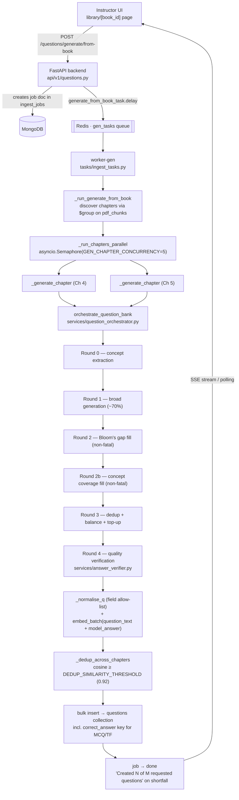
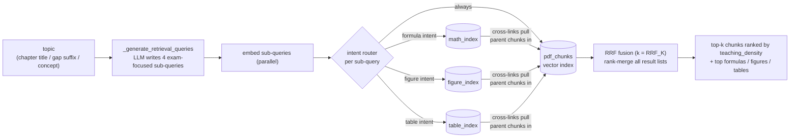
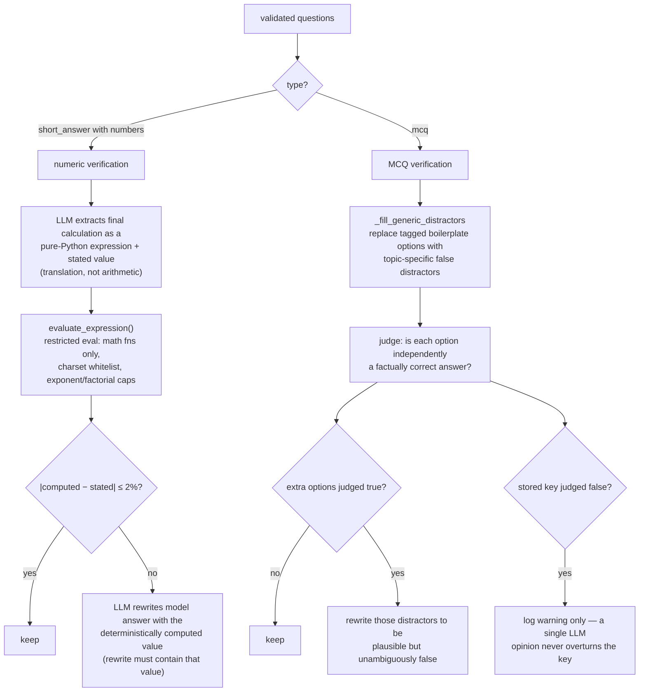
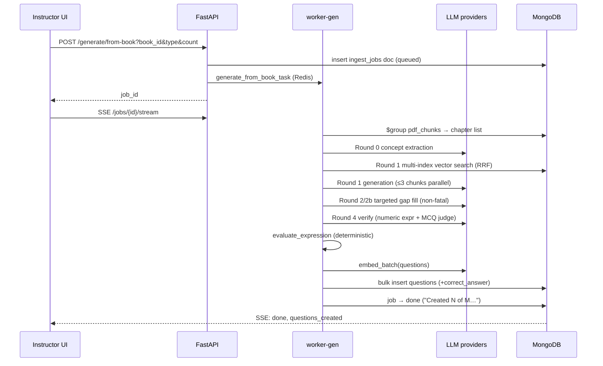

# Question Generation — Detailed Architecture

How a "Generate ~N Questions" click becomes verified questions in the bank.
Companion to [GENERATION_PIPELINE.md](GENERATION_PIPELINE.md) (conceptual
walkthrough); this document is the component-level map, traced from code.

---

## 1. End-to-end flow

The UI watches the job over the SSE endpoint
(`GET /questions/jobs/{id}/stream`), falling back to 5-second polling.

---

## 2. Retrieval: DeepSearch + multi-index routing

Every generation round retrieves through the same stack
(`deep_retrieve_for_generation` → `retrieval_router.routed_retrieve`):

Specialist hits matter twice: they re-rank their **source chunks** into the
fused result (cross-links), and the raw formulas/figures/tables feed the
targeted prompts in Round 2 (L3 gets verbatim LaTeX, L4 gets real
figures/tables — `_specialist_context`).

---

## 3. The orchestrator rounds

| Round | Function | What it does | On failure |
|---|---|---|---|
| 0 | `extract_chapter_concepts` | LLM decomposes the chapter into key concepts + enriched topic string | falls back to bare topic |
| 1 | `generate_questions_from_chunks` | retrieve top chunks → select by `_score_chunk` (teaching density, formulas, examples) → up to 3 chunks generate concurrently with `_PLAIN_TEXT_PROMPT` (Bloom's guide + 4-level uniqueness block) → prefix dedup → `_validate_questions` | chapter fails only if Round 1 yields nothing |
| 2 | `_audit_bloom_gaps` → `generate_targeted_bloom_questions` | for each under-represented Bloom level: focused retrieval (`retrieval_suffix + topic`) and generation locked to that level, augmented with specialist context | **non-fatal** — gap skipped, accumulated questions kept |
| 2b | concept coverage | up to 5 uncovered Round-0 concepts get one targeted L3 question each | **non-fatal** per concept |
| 3 | `_dedup_by_prefix` + `_balance_bloom_distribution` | trim duplicates and over-represented levels; top-up pass if > 20% below target | top-up best-effort |
| 4 | `verify_generated_questions` | see §4 | **non-fatal** per question |

`_validate_questions` (Round 1/2 output) is also where structure is enforced:
`_normalise_mcq` rebuilds MCQs as stem + A–D options, extracts the
`correct_answer` letter, and tags any placeholder-filled options with
`_generic_distractors` for Round 4 to replace. True/False answers get
`correct_answer` parsed from the model answer.

---

## 4. Round 4 — quality verification (`answer_verifier.py`)

Why the split design for numeric checks: LLMs are unreliable at arithmetic
but reliable at *translation*. The number that ends up in the stored model
answer always comes from Python, never from the model. (Observed failure
that motivated this: the LLM "recomputed" C(20,12)·0.35¹²·0.65⁸ as 0.0515;
the true value is 0.0136.)

Why MCQs must be unambiguous: marking compares the student's letter against
`correct_answer` deterministically — there is no model at marking time to
notice that a distractor was synonymous with the right answer.

---

## 5. Marking-time contract

What generation guarantees the marking pipeline can rely on:

| Field | Guarantee |
|---|---|
| `correct_answer` | present for MCQ ("A"–"D") and True/False ("True"/"False"); never exposed via the student assessment endpoint |
| `model_answer` | numeric results deterministically verified (short answer) |
| MCQ options | exactly one factually correct option |
| `embedding` | 768-dim, embedded from `question_text + model_answer` |
| `rubric` | per-mark criteria (used by SLM pre-scorer + LLM marker) |

---

## 6. Sequence (happy path, one chapter)

---

## 7. Tuning knobs

| Setting | Default | Effect |
|---|---|---|
| `GEN_CHAPTER_CONCURRENCY` | 5 | chapters generated in parallel; lower to 2–3 on rate-limited keys |
| `DEDUP_SIMILARITY_THRESHOLD` | 0.92 | cross-chapter cosine dedup cut-off |
| `RRF_K` | (config) | rank-fusion constant for multi-index retrieval |
| `count_per_chapter` | request param (1–50) | target per chapter; shortfall is reported, not silent |

Failure semantics in one line: **a chapter only fails if Round 1 produces
nothing; everything after Round 1 is enrichment and degrades gracefully.**
Transient provider errors (408/429/431/5xx) retry with backoff inside every
client before any of this logic sees them.
